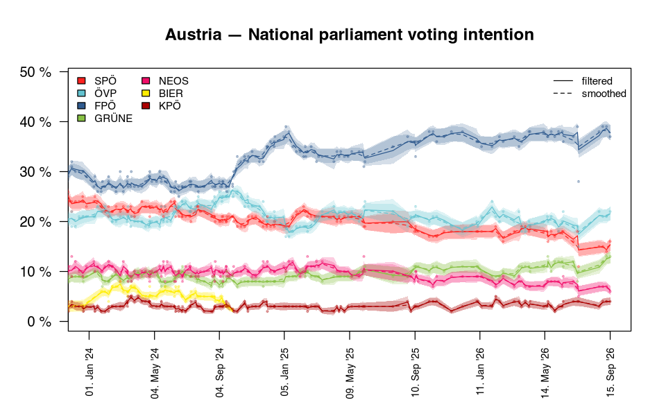
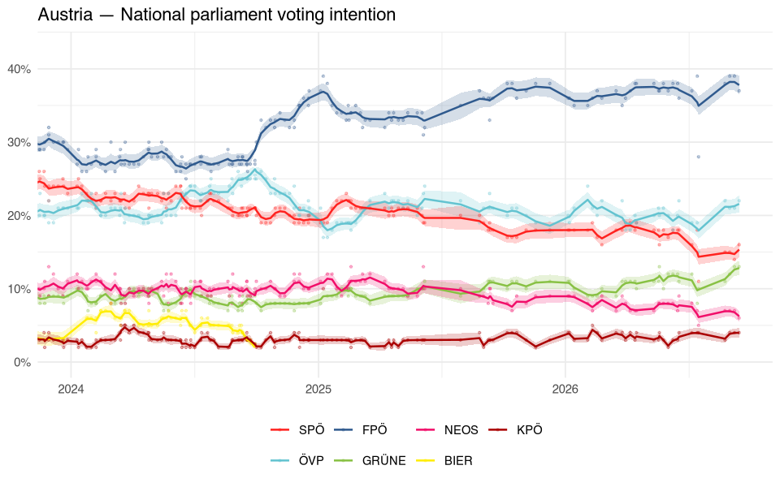
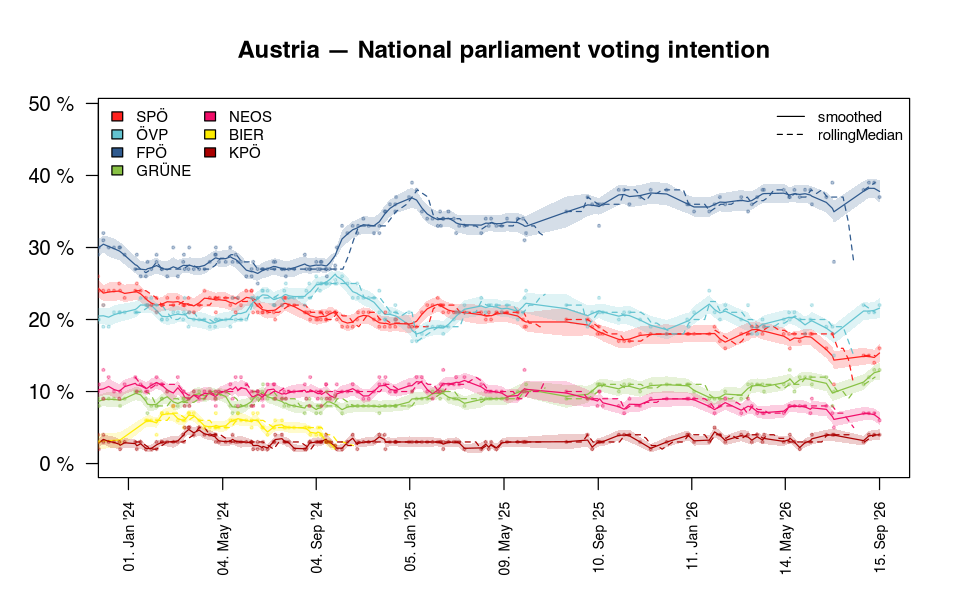

<!-- pollofpolls.Rmd is generated from pollofpolls.Rmd.orig by precompute.R, edit the .orig file. -->


This article walks through a typical session with the Austrian national
parliament polls. Everything works the same way for every other poll published
by [POLITICO's Poll of Polls](https://www.politico.eu/europe-poll-of-polls/).
The output below was generated with the data published on
2026-10-09.


``` r
library(pollofpolls)
library(data.table)
```

## Reading polls

`popGetInfo()` lists the available polls. It visits every country page once
and caches the result for a day, so the first call takes a while.


``` r
popGetInfo()
```

`popRead()` downloads a poll. The result is a `popPolls` object, a list of
`data.table`s: one row per poll in `$polls`, election results in `$elections`,
party codes, names and colours in `$parties` and the trends POLITICO publishes
in `$trends`.


``` r
at = popRead('AT-parliament')
at
#> Austria — National parliament voting intention 
#> Retrieved: 2026-10-09 19:44 
#> 
#> Polls:
#> 
#>        date   dateFrom              firm     n  SPOE  OEVP  FPOE GRUENE    TS
#>      <Date>     <Date>            <char> <int> <num> <num> <num>  <num> <num>
#>  2013-10-03 2013-10-03            Gallup   400  0.28  0.23  0.21   0.13    NA
#>  2013-10-17 2013-10-17            Gallup   400  0.28  0.23  0.22   0.13    NA
#>  2013-10-20 2013-10-20            Market   603  0.25  0.23  0.25   0.12    NA
#>  2013-10-25 2013-10-25            Gallup   400  0.27  0.24  0.22   0.13    NA
#>  2013-10-26 2013-10-26          Karmasin   500  0.26  0.23  0.23   0.12    NA
#>         ---        ---               ---   ---   ---   ---   ---    ---   ---
#>  2026-07-17 2026-07-15              IFDD  1000  0.11  0.15  0.28   0.10    NA
#>  2026-08-25 2026-08-17 Market Lazarsfeld  2000  0.15  0.22  0.38   0.11    NA
#>  2026-09-01 2026-08-31 Market Lazarsfeld  2000  0.15  0.21  0.39   0.12    NA
#>  2026-09-08 2026-09-07 Market Lazarsfeld  2000  0.14  0.21  0.39   0.13    NA
#>  2026-09-15 2026-09-14 Market Lazarsfeld  2000  0.16  0.22  0.37   0.13    NA
#>   NEOS Jetzt   HCS   MFG  BIER  KPOE
#>  <num> <num> <num> <num> <num> <num>
#>   0.07    NA    NA    NA    NA    NA
#>   0.08    NA    NA    NA    NA    NA
#>   0.07    NA    NA    NA    NA    NA
#>   0.08    NA    NA    NA    NA    NA
#>   0.08    NA    NA    NA    NA    NA
#>    ---   ---   ---   ---   ---   ---
#>   0.05    NA    NA    NA    NA  0.04
#>   0.07    NA    NA    NA    NA  0.03
#>   0.07    NA    NA    NA    NA  0.04
#>   0.07    NA    NA    NA    NA  0.04
#>   0.06    NA    NA    NA    NA  0.04
#> 
#> Elections: 2013-09-29 2017-10-15 2019-09-29 2024-09-29 
#> Trends: kalmanSmooth, kalman
at$parties
#>       code          name   color
#>     <char>        <char>  <char>
#>  1:   SPOE           SPÖ #FF221F
#>  2:   OEVP           ÖVP #63c3d0
#>  3:   FPOE           FPÖ #2F5A8E
#>  4: GRUENE         GRÜNE #88C144
#>  5:     TS Team Stronach #facd50
#>  6:   NEOS          NEOS #F10E69
#>  7:  Jetzt         Jetzt #bbbbbb
#>  8:    HCS            HC #4a9dd9
#>  9:    MFG           MFG #6e706e
#> 10:   BIER          BIER #FFED00
#> 11:   KPOE           KPÖ #aa0000
```

Shares are stored as fractions (`0.27` = 27 %), seat projections such as
`NL-parliament` as absolute numbers.

## Trends

`popAddTrend()` adds a poll aggregation. The default is a Kalman filter, which
treats the true support of a party as a random walk and every poll as a noisy
measurement of it, weighted by its sample size. `sd` is the daily standard
deviation of the random walk: larger values follow the polls more closely.

The filter only looks back in time. With `smoothing = TRUE`, every estimate also
takes the later polls into account, which removes the lag behind sudden
changes. The estimates are calculated for the dates with polls;
`linearInterpolation` turns them into a daily series.


``` r
at = popAddTrend(at, name = 'filtered', type = 'kalman', args = list(sd = 0.003))
at = popAddTrend(at, name = 'smoothed', type = 'kalman',
                 args = list(sd = 0.003, smoothing = TRUE),
                 interpolations = list(linearInterpolation = list()))
names(at$trends)
#> [1] "kalmanSmooth" "kalman"       "filtered"     "smoothed"
```

The smoothed trend is the method behind POLITICO's own `kalmanSmooth` trend:


``` r
both = merge(at$trends$smoothed, at$trends$kalmanSmooth, by = c('date', 'party'))
both[, .(days = uniqueN(date), meanAbsDifference = mean(abs(value.x - value.y)))]
#>     days meanAbsDifference
#>    <int>             <num>
#> 1:  4735      0.0005051443
```

`plot()` draws the polls as points and every trend as a line. Trends with a
variance, such as the Kalman trends, come with a 95 % uncertainty band.


``` r
at$trends$kalmanSmooth = NULL
at$trends$kalman = NULL
plot(at, xlim = c('2024-01-01', NA))
```

<div class="figure">

<p class="caption">plot of chunk unnamed-chunk-7</p>
</div>

## ggplot2

`autoplot()` draws the same with ggplot2 and returns an ordinary ggplot object,
so layers, scales and themes can be added as usual.


``` r
library(ggplot2)

at$trends$filtered = NULL
autoplot(at, xlim = c('2024-01-01', NA), level = 0.9) +
    theme_minimal() +
    theme(legend.position = 'bottom')
```

<div class="figure">

<p class="caption">plot of chunk unnamed-chunk-8</p>
</div>

For anything else, `popLong()` returns polls, election results and trends in
long format:


``` r
popLong(at)
popLong(at, 'trends')
#>           trend       date  party      value     variance
#>          <char>     <Date> <char>      <num>        <num>
#>     1: smoothed 2013-09-29   SPOE 0.26820000 0.000000e+00
#>     2: smoothed 2013-09-29   OEVP 0.23990000 0.000000e+00
#>     3: smoothed 2013-09-29   FPOE 0.20510000 0.000000e+00
#>     4: smoothed 2013-09-29 GRUENE 0.12420000 0.000000e+00
#>     5: smoothed 2013-09-29     TS 0.05730000 0.000000e+00
#>    ---                                                   
#> 28541: smoothed 2026-09-15   OEVP 0.21578371 4.840253e-05
#> 28542: smoothed 2026-09-15   FPOE 0.37785585 6.035729e-05
#> 28543: smoothed 2026-09-15 GRUENE 0.12816831 3.597781e-05
#> 28544: smoothed 2026-09-15   NEOS 0.06244160 2.127859e-05
#> 28545: smoothed 2026-09-15   KPOE 0.03992564 1.542379e-05
```

## Current standings and seats

`popLatest()` summarises a trend (by default the one added last) at a date: the
estimated support, its uncertainty, the change over the last 30 days and the
result of the last election.


``` r
popLatest(at)
#>     party   name       date      value      lower      upper       change
#>    <char> <char>     <Date>      <num>      <num>      <num>        <num>
#> 1:   FPOE    FPÖ 2026-09-15 0.37785585 0.36262890 0.39308280  0.006349343
#> 2:   OEVP    ÖVP 2026-09-15 0.21578371 0.20214787 0.22941956  0.011448049
#> 3:   SPOE    SPÖ 2026-09-15 0.15342759 0.14097285 0.16588234  0.005771269
#> 4: GRUENE  GRÜNE 2026-09-15 0.12816831 0.11641215 0.13992447  0.018329771
#> 5:   NEOS   NEOS 2026-09-15 0.06244160 0.05340054 0.07148267 -0.004984389
#> 6:   KPOE    KPÖ 2026-09-15 0.03992564 0.03222825 0.04762304  0.006330997
#>    election
#>       <num>
#> 1:    0.289
#> 2:    0.263
#> 3:    0.211
#> 4:    0.082
#> 5:    0.091
#> 6:    0.024
```

`popSeats()` converts these shares into seats. The Austrian Nationalrat has 183
seats, a 4 % threshold and allocates the remaining seats on the federal level
with the D'Hondt method, which a national projection approximates well:


``` r
popSeats(at, seats = 183, threshold = 0.04, method = 'dhondt')
#>     party   name      share seats
#>    <char> <char>      <num> <int>
#> 1:   FPOE    FPÖ 0.37785585    74
#> 2:   OEVP    ÖVP 0.21578371    42
#> 3:   SPOE    SPÖ 0.15342759    30
#> 4: GRUENE  GRÜNE 0.12816831    25
#> 5:   NEOS   NEOS 0.06244160    12
#> 6:   KPOE    KPÖ 0.03992564     0
```

## Polling firms

`popFirms()` lists the firms behind the polls, `popHouseEffects()` estimates how
much each firm deviates from the consensus for each party, i.e. from a smoothed
Kalman trend through all polls:


``` r
popFirms(at)
#>                               firm polls      first       last sampleSize
#>                             <char> <int>     <Date>     <Date>      <int>
#>  1:               Research Affairs   162 2016-12-08 2021-09-30        600
#>  2:                Unique Research   119 2014-06-06 2026-06-18        800
#>  3:                         Market    97 2013-10-20 2025-07-30        800
#>  4:                         Gallup    81 2013-10-03 2016-12-10        400
#>  5:                            OGM    57 2014-04-06 2026-05-20        984
#>  6:              Market/Lazarsfeld    53 2022-05-19 2024-04-25       1000
#>  7:              Market Lazarsfeld    45 2024-04-24 2026-09-15       2000
#>  8:              Market-Lazarsfeld    40 2023-03-29 2026-05-19       2000
#>  9: Market/Lazarsfeld Gesellschaft    34 2023-05-24 2024-04-29       1000
#> 10:                           IFDD    32 2021-02-01 2026-07-17       1054
#> 11:                    Peter Hajek    23 2018-08-29 2024-02-29        800
#> 12:                           IMAS    20 2014-01-18 2018-05-09       1000
#> 13:                Unique research    20 2020-01-10 2021-07-08        802
#> 14:                          Hajek    18 2013-12-12 2018-10-31        700
#> 15:                        Spectra     9 2017-03-26 2025-02-14       1000
#> 16:                       Karmasin     8 2013-10-26 2020-01-15       2000
#> 17:                meinungsraum.at     7 2014-01-15 2017-05-14        800
#> 18:                       AKonsult     5 2014-09-19 2017-08-04        603
#> 19:                 Demox Research     5 2019-02-08 2019-09-14       1250
#> 20:                            GfK     5 2017-04-06 2018-12-09       1500
#> 21:                           IFES     3 2015-06-23 2017-07-04       1000
#> 22:                           INSA     3 2025-08-27 2026-07-15       1000
#> 23:                           SORA     2 2016-08-20 2019-06-10        956
#> 24:                        cmatzka     2 2017-07-12 2017-09-22        800
#> 25:                 IFES (for SPÖ)     1 2019-07-10 2019-07-10        936
#> 26:              Market-Lazarsfelt     1 2024-03-27 2024-03-27       2000
#> 27:    Unique Research/Peter Hajek     1 2023-06-29 2023-06-29        804
#> 28:                            ogm     1 2025-04-09 2025-04-09       1042
#>                               firm polls      first       last sampleSize
#>                             <char> <int>     <Date>     <Date>      <int>

effects = popHouseEffects(at, minPolls = 10)
# percentage points, one row per firm
effects[, effect := round(100*effect, 1)]
dcast(effects, firm ~ party, value.var = 'effect')
#> Key: <firm>
#>                               firm  BIER  FPOE GRUENE   HCS Jetzt  KPOE   MFG
#>                             <char> <num> <num>  <num> <num> <num> <num> <num>
#>  1:                         Gallup    NA   0.2    0.2    NA    NA    NA    NA
#>  2:                          Hajek    NA   0.4    0.0    NA    NA    NA    NA
#>  3:                           IFDD    NA  -0.2   -0.2    NA    NA   0.2    NA
#>  4:                           IMAS    NA  -1.0    0.4    NA    NA    NA    NA
#>  5:                         Market  -0.2   0.2    0.3    NA   0.1  -0.3    NA
#>  6:              Market Lazarsfeld    NA   0.2    0.0    NA    NA   0.1    NA
#>  7:              Market-Lazarsfeld   0.0   0.0    0.0    NA    NA   0.0    NA
#>  8:              Market/Lazarsfeld   0.0   0.1    0.0    NA    NA    NA  -0.1
#>  9: Market/Lazarsfeld Gesellschaft    NA  -0.1    0.1    NA    NA   0.1    NA
#> 10:                            OGM    NA  -0.1    0.1    NA  -0.1   0.1    NA
#> 11:                    Peter Hajek    NA   0.4    0.2    NA    NA    NA    NA
#> 12:               Research Affairs    NA  -0.2   -0.2   0.1   0.1    NA    NA
#> 13:                Unique Research    NA   0.1    0.1    NA   0.0   0.0   0.6
#> 14:                Unique research    NA   1.5    0.5    NA    NA    NA    NA
#>      NEOS  OEVP  SPOE    TS
#>     <num> <num> <num> <num>
#>  1:   0.3  -0.3   0.0    NA
#>  2:   0.5   0.1  -0.1    NA
#>  3:  -0.3   0.2   0.3    NA
#>  4:  -1.0   1.5   0.7   0.2
#>  5:   0.3  -0.4   0.1   0.0
#>  6:   0.0  -0.2   0.0    NA
#>  7:   0.2   0.0   0.0    NA
#>  8:   0.4  -0.3   0.3    NA
#>  9:   0.5  -0.3   0.2    NA
#> 10:  -0.2   0.4   0.2    NA
#> 11:  -0.3   0.4  -0.4    NA
#> 12:   0.1   0.2  -0.5    NA
#> 13:   0.2   0.3   0.0   0.1
#> 14:   0.2  -0.1  -0.7    NA
```

## Custom trends

`popAddTrend()` also takes a function. It gets the `popPolls` object as `data`
and returns a long table with the columns `date`, `party` and `value` (and
optionally `variance`). For example, the median of the polls of the last few
weeks:


``` r
rollingMedian = function(data, days = 21) {
    polls = popLong(data)[date >= as.Date('2024-01-01')]
    dates = seq(min(polls$date), max(polls$date), by = 'week')
    polls[, .(date = dates,
              value = vapply(dates, function(d) median(value[date > d - days & date <= d]),
                             numeric(1))),
          by = party]
}

at = popAddTrend(at, type = rollingMedian, args = list(days = 28))
```


``` r
plot(at, xlim = c('2024-01-01', NA))
```

<div class="figure">

<p class="caption">plot of chunk unnamed-chunk-14</p>
</div>

## Working offline

`popDownload()` saves the data of several polls as published, and
`popRead(dir = ...)` reads it back without sending a request:


``` r
popDownload('polls', codes = c('AT-parliament', 'DE-parliament'))
de = popRead('DE-parliament', dir = 'polls')
```

Within a session, `options(pollofpolls.dataMaxAge = 3600)` keeps downloaded
data for an hour instead of fetching it again on every `popRead()`.
